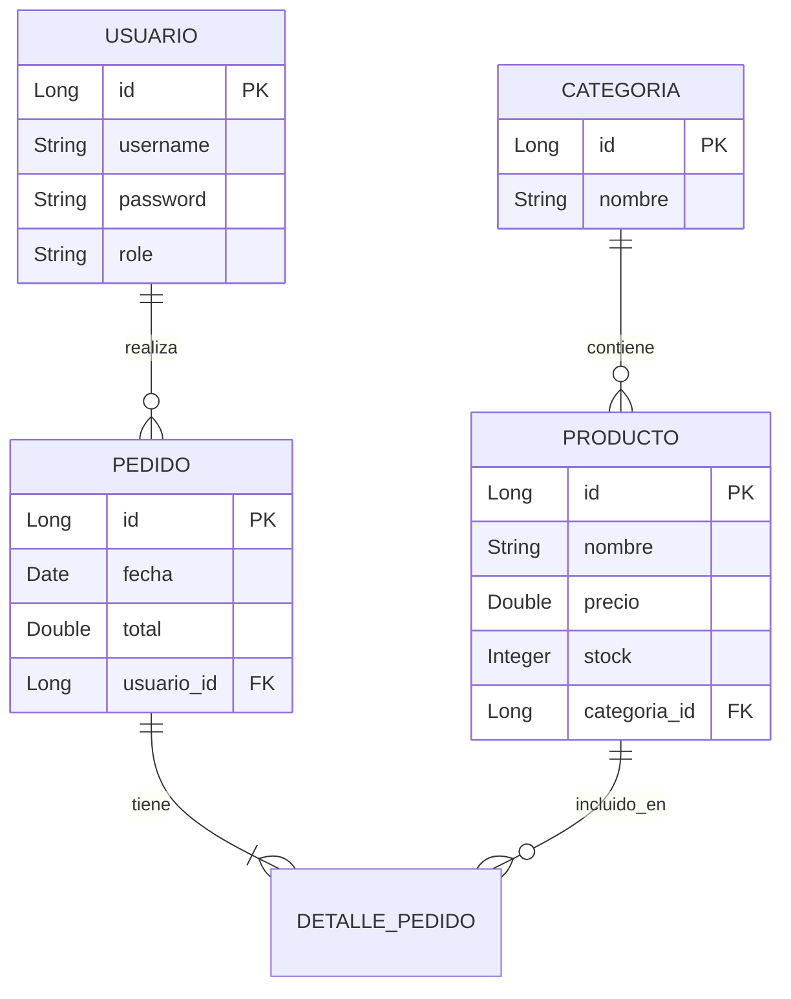
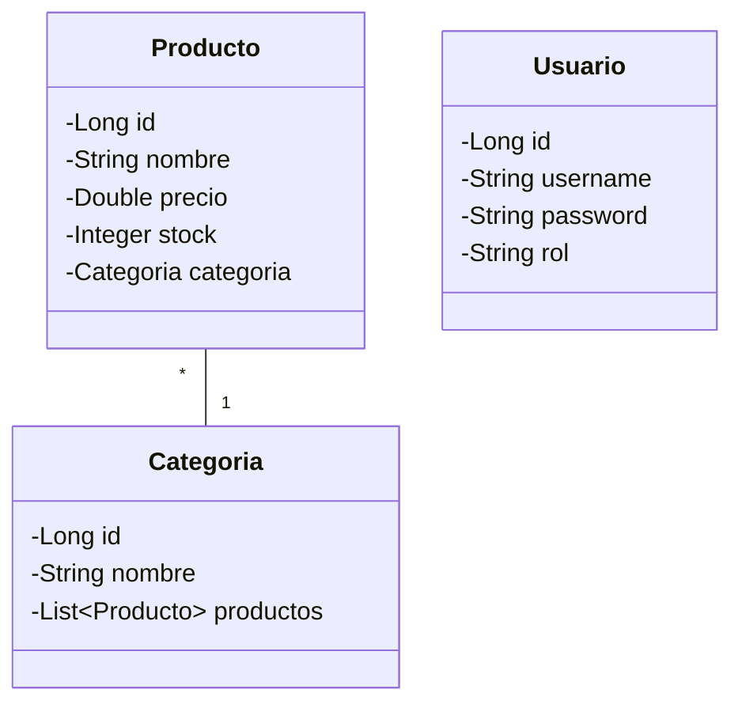

# Propuesta de Proyecto Final - TiendaNiche

## 1. Descripción General
**TiendaNiche** es una plataforma de comercio electrónico especializada (café premium, accesorios, etc.) desarrollada como proyecto final de ciclo. La aplicación permite a los usuarios navegar por un catálogo de productos y a los administradores gestionar el inventario.

## 2. Tecnologías Utilizadas
- **Backend**: Java 17, Spring Boot 3.2, Spring Data JPA, Spring MVC.
- **Frontend**: Thymeleaf, Bootstrap 5, HTML5, CSS3.
- **Base de Datos**: MySQL 8.
- **Infraestructura**: Docker, Docker Compose.
- **Herramientas**: Maven, Git/GitHub.

## 3. Arquitectura
La aplicación sigue una arquitectura monolítica basada en el patrón **MVC (Modelo-Vista-Controlador)** con separación de responsabilidades en capas:

1.  **Controladores (`@Controller`)**: Manejan las peticiones HTTP y seleccionan la vista.
2.  **Servicios (`@Service`)**: Contienen la lógica de negocio.
3.  **Repositorios (`@Repository`)**: Capa de acceso a datos (DAO) usando Spring Data JPA.
4.  **Modelo (`@Entity`)**: Representación de los datos mapeados a la base de datos.

## 4. Estructura de Base de Datos
La base de datos relacional (MySQL) consta de las siguientes tablas principales:

### Modelo E-R (Mermaid)


## 5. Diagrama de Clases


## 6. Instrucciones de Despliegue

### Requisitos Previos
- Docker y Docker Compose instalados.
- Java 17 (para desarrollo local sin Docker).

### Ejecución con Docker (Recomendado)
Desde la raíz del proyecto, ejecutar:

```bash
docker-compose up --build
```

La aplicación estará disponible en: `http://localhost:8080`.
Base de datos MySQL en puerto: `3306`.

### Usuarios de Prueba (DataInitializer)
- **Admin**: admin / admin (Rol ADMIN - puede gestionar productos)
- **User**: user / user (Rol USER)

---
**Curso:** Desarrollo de Aplicaciones Web / Multiplataforma
**Fecha:** Abril 2026
