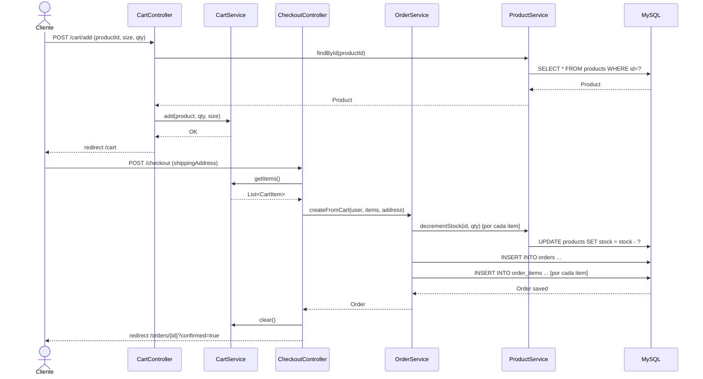

# Diagrama de clases · Snikers Shop

Representación UML de las clases principales de la aplicación, agrupadas por capa arquitectónica (MVC).

```mermaid
classDiagram
    direction TB

    %% ===== Capa Modelo (Entidades JPA) =====
    class Category {
        -Long id
        -String name
        -String slug
        -String description
        -List~Product~ products
    }

    class Product {
        -Long id
        -String name
        -String brand
        -String description
        -BigDecimal price
        -BigDecimal originalPrice
        -Integer stock
        -String imageUrl
        -String color
        -String sizeRange
        -Boolean featured
        -Boolean active
        -LocalDateTime createdAt
        -LocalDateTime updatedAt
        -Category category
        +getDiscountPercentage() int
    }

    class User {
        -Long id
        -String fullName
        -String email
        -String password
        -String phone
        -String address
        -Role role
        -LocalDateTime createdAt
        -List~Order~ orders
    }

    class Order {
        -Long id
        -String orderNumber
        -User user
        -List~OrderItem~ items
        -BigDecimal total
        -Status status
        -String shippingAddress
        -LocalDateTime createdAt
    }

    class OrderItem {
        -Long id
        -Order order
        -Product product
        -Integer quantity
        -BigDecimal unitPrice
        -String size
        +getSubtotal() BigDecimal
    }

    class CartItem {
        -Long productId
        -String name
        -String brand
        -String imageUrl
        -BigDecimal unitPrice
        -Integer quantity
        -String size
        +getSubtotal() BigDecimal
    }

    %% ===== Capa Repositorio =====
    class CategoryRepository {
        <<interface>>
        +findAll() List~Category~
        +findByNameIgnoreCase(String) Optional~Category~
        +findBySlug(String) Optional~Category~
    }

    class ProductRepository {
        <<interface>>
        +findByActiveTrue() List~Product~
        +findByFeaturedTrueAndActiveTrue() List~Product~
        +findByCategoryIdAndActiveTrue(Long, Pageable) Page~Product~
        +search(String, Pageable) Page~Product~
    }

    class UserRepository {
        <<interface>>
        +findByEmail(String) Optional~User~
        +existsByEmail(String) boolean
    }

    class OrderRepository {
        <<interface>>
        +findByUserIdOrderByCreatedAtDesc(Long) List~Order~
        +findByOrderNumber(String) Optional~Order~
    }

    %% ===== Capa Servicio =====
    class CategoryService {
        +findAll() List~Category~
        +findById(Long) Category
        +save(Category) Category
        +delete(Long) void
    }

    class ProductService {
        +findAllActive(Pageable) Page~Product~
        +findFeatured() List~Product~
        +findById(Long) Product
        +search(String, Pageable) Page~Product~
        +save(Product) Product
        +update(Long, Product) Product
        +softDelete(Long) void
        +decrementStock(Long, int) void
    }

    class UserService {
        +loadUserByUsername(String) UserDetails
        +register(User) User
        +findByEmail(String) User
    }

    class CartService {
        +getItems() List~CartItem~
        +add(Product, int, String) void
        +remove(Long, String) void
        +updateQuantity(Long, String, int) void
        +clear() void
        +getTotal() BigDecimal
        +getTotalItems() int
    }

    class OrderService {
        +createFromCart(User, List~CartItem~, String) Order
        +findByUser(Long) List~Order~
        +findById(Long) Order
        +updateStatus(Long, Status) Order
    }

    %% ===== Capa Controlador =====
    class HomeController {
        +home(Model) String
    }

    class ProductController {
        +list(Long, String, int, int, String, Model) String
        +detail(Long, Model) String
        +search(String, Model) String
    }

    class CartController {
        +view(Model) String
        +add(Long, int, String) String
        +update(Long, String, int) String
        +remove(Long, String) String
        +clear() String
    }

    class CheckoutController {
        +checkoutForm(UserDetails, Model) String
        +processCheckout(UserDetails, String, Model) String
    }

    class OrderController {
        +myOrders(UserDetails, Model) String
        +detail(Long, Boolean, UserDetails, Model) String
    }

    class AuthController {
        +loginForm(String, String, Model) String
        +registerForm(Model) String
        +register(User, BindingResult, Model) String
    }

    class AdminController {
        +dashboard(Model) String
        +products(Model) String
        +saveProduct(Product, BindingResult, Long, Model) String
        +deleteProduct(Long) String
        +categories(Model) String
        +orders(Model) String
        +updateOrderStatus(Long, String) String
    }

    %% ===== Relaciones entre clases =====
    Category "1" --> "N" Product : contiene
    User "1" --> "N" Order : realiza
    Order "1" --> "N" OrderItem : incluye
    Product "1" --> "N" OrderItem : aparece en

    %% Servicios usan repositorios
    CategoryService --> CategoryRepository
    ProductService --> ProductRepository
    UserService --> UserRepository
    OrderService --> OrderRepository
    OrderService --> ProductService

    %% Controladores usan servicios
    HomeController --> ProductService
    HomeController --> CategoryService
    ProductController --> ProductService
    CartController --> CartService
    CartController --> ProductService
    CheckoutController --> CartService
    CheckoutController --> OrderService
    OrderController --> OrderService
    AuthController --> UserService
    AdminController --> ProductService
    AdminController --> CategoryService
    AdminController --> OrderService
```

## Explicación de la arquitectura

La aplicación sigue el patrón **MVC** con una separación en **tres capas** respaldada por anotaciones Spring:

### 1. Capa de presentación (`@Controller`)
- Recibe peticiones HTTP y devuelve vistas Thymeleaf.
- **Nunca** accede directamente a repositorios — delega en servicios.
- Gestiona autenticación con `@AuthenticationPrincipal`.

### 2. Capa de servicio (`@Service`)
- Contiene la lógica de negocio (validaciones, flujos, cálculos).
- `@Transactional` asegura la atomicidad de operaciones complejas (checkout).
- `UserService` implementa `UserDetailsService` para integrarse con Spring Security.

### 3. Capa de persistencia (`@Repository`)
- Interfaces que extienden `JpaRepository<T, ID>`.
- Spring Data genera la implementación automáticamente.
- Consultas personalizadas con `@Query` (búsqueda de productos).

### Entidades del dominio
- Anotadas con `@Entity` y mapeadas a MySQL.
- Las relaciones usan `@OneToMany`/`@ManyToOne` con `FetchType.LAZY` para evitar N+1.
- Validaciones Bean Validation (`@NotBlank`, `@Email`, `@Min`, ...).

### Diagrama de secuencia simplificado (flujo de compra)

