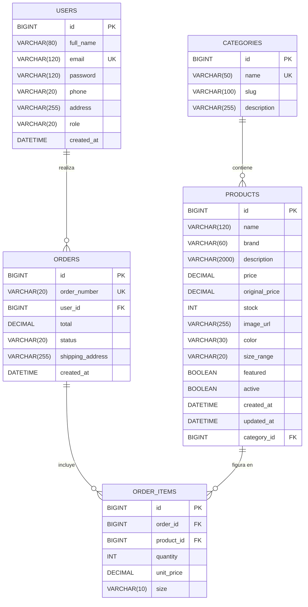

## Modelo Entidad-Relación · Snikers Shop

### Entidades y cardinalidades

| Relación | Cardinalidad | Lectura |
|----------|--------------|---------|
| Categories — Products | 1 : N | Una categoría tiene N productos; un producto pertenece a 1 categoría |
| Users — Orders | 1 : N | Un usuario realiza N pedidos; un pedido pertenece a 1 usuario |
| Orders — Order_Items | 1 : N | Un pedido incluye N líneas; cada línea pertenece a 1 pedido |
| Products — Order_Items | 1 : N | Un producto figura en N líneas de pedido |

La tabla `order_items` actúa como **tabla puente** en una relación N:M entre `orders` y `products`, guardando además atributos propios (cantidad, talla, precio unitario).

### Claves

- **Primarias:** todas las tablas usan `id BIGINT AUTO_INCREMENT`.
- **Foráneas:**
  - `products.category_id → categories.id`
  - `orders.user_id → users.id`
  - `order_items.order_id → orders.id`
  - `order_items.product_id → products.id`
- **Únicas:** `categories.name`, `users.email`, `orders.order_number`.
